# XGen Protocol — Appendix C: Primitive Schemas & Inheritance Diagrams
> Status: wip
> Version: 0.3
> Date: April 2026
> Last edited: April 2026
> Language: English
> Author: JozefN
> License: BSL 1.1 (converts to GPL upon project handover)
> Note: Slovak translation planned — will be saved as xgen_appendix_c_sk.md

---

## Purpose

This appendix provides a complete reference of all XGen Protocol primitive schemas and their inheritance relationships in a single document. It is intended as a theoretical implementation guide — a developer starting work on a Node, client, or Auth Module should read this appendix alongside Chapter 3 (Specification) to understand both the data structures and how they relate to each other.

All diagrams use [Mermaid](https://mermaid.js.org/) class diagram syntax, which renders natively in GitHub, VS Code with the Mermaid extension, and most modern markdown viewers.

**Datetime convention:** all datetime fields in this document use RFC 3339 UTC format — `"2026-04-25T12:32:00.000Z"`. See Chapter 2 — Datetime Standard section for full rationale.

**Self-referencing relationships note:** Mermaid renders self-referencing arrows (a class pointing to itself) as empty ghost boxes. Three relationships of this type exist in the protocol — `Event.prev_events`, `Device.authorised_by`, and `Node.federates_with` — and are documented as comments in the relevant diagrams rather than as arrows.

---

## C.0 — Base Classes

Every XGen primitive inherits from one of two abstract base classes. No concrete primitive exists outside this hierarchy.

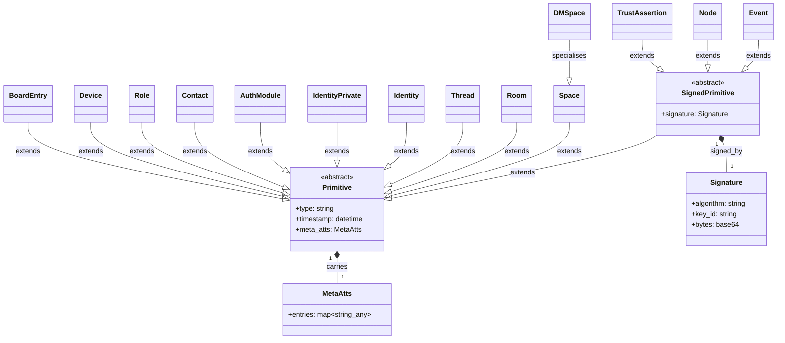
```mermaid
classDiagram
    class Primitive {
        <<abstract>>
        +type: string
        +timestamp: datetime
        +meta_atts: MetaAtts
    }
    class SignedPrimitive {
        <<abstract>>
        +signature: Signature
    }
    class MetaAtts {
        +entries: map~string_any~
    }
    class Signature {
        +algorithm: string
        +key_id: string
        +bytes: base64
    }

    SignedPrimitive --|> Primitive : extends

    class Event
    class Node
    class TrustAssertion
    Event --|> SignedPrimitive : extends
    Node --|> SignedPrimitive : extends
    TrustAssertion --|> SignedPrimitive : extends

    class Space
    class DMSpace
    class Room
    class Thread
    class Identity
    class IdentityPrivate
    class AuthModule
    class Contact
    class Role
    class Device
    class BoardEntry
    Space --|> Primitive : extends
    DMSpace --|> Space : specialises
    Room --|> Primitive : extends
    Thread --|> Primitive : extends
    Identity --|> Primitive : extends
    IdentityPrivate --|> Primitive : extends
    AuthModule --|> Primitive : extends
    Contact --|> Primitive : extends
    Role --|> Primitive : extends
    Device --|> Primitive : extends
    BoardEntry --|> Primitive : extends

    Primitive "1" *-- "1" MetaAtts : carries
    SignedPrimitive "1" *-- "1" Signature : signed_by
```

### Primitive (abstract)

The universal base class. Every XGen protocol entity is a Primitive.

| Field | Type | Description |
|---|---|---|
| `type` | string | Declared primitive type — open enum, dot-namespaced |
| `timestamp` | datetime | RFC 3339 UTC — when this primitive came into existence |
| `meta_atts` | MetaAtts | Universal namespaced key-value extension map |

**On `type`:** the type field makes every XGen object self-identifying. A parser encountering any primitive can determine what it is before reading any other field. The type enum is open — new values can be added without breaking existing implementations.

**On `timestamp`:** the semantic alias varies by primitive — `created_at`, `issued_at`, `added_at`, `pinned_at`, `authorised_at` — but the underlying type and format is always RFC 3339 UTC datetime.

**On `meta_atts`:** opaque to the protocol core. Stored and propagated but never interpreted. Namespaced to prevent collisions. See C.12 for the full meta-atts model.

### SignedPrimitive (abstract) extends Primitive

Primitives that travel the network and require cryptographic verification. Inherits all Primitive fields.

| Field | Type | Description |
|---|---|---|
| `signature` | Signature | Algorithm-agile cryptographic signature |

Only three primitives are SignedPrimitives: **Event**, **Node**, and **TrustAssertion**. These are the three entities whose authenticity must be independently verifiable by any recipient without trusting the source.

### Type values per primitive

| Primitive | type value |
|---|---|
| Event | `message.text`, `room.member.join`, `identity.key.rotate`, etc. (open enum — see C.2) |
| Thread | `thread` |
| Room | `room.text`, `room.voice`, `room.forum`, etc. |
| Space | `space` |
| DMSpace | `space.dm` |
| Node | `node` |
| Identity | `identity` |
| IdentityPrivate | `identity.private` |
| TrustAssertion | `trust_assertion` |
| AuthModule | `auth_module` |
| Contact | `contact` |
| Role | `role` |
| Device | `device` |
| BoardEntry | `board_entry` |

---

## C.1a — Infrastructure & Protocol Primitives

Inheritance and relationships for Machine, Node, Space, Room, Thread, Event, Role and BoardEntry.

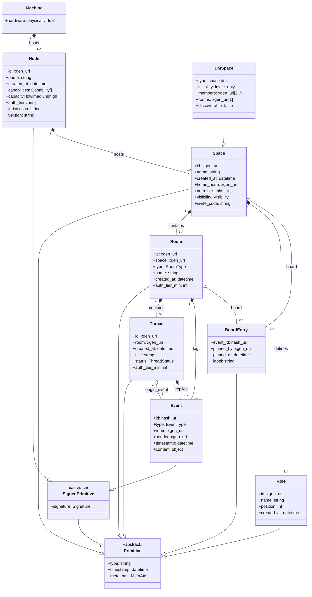
```mermaid
classDiagram

    %% ── Base classes ──────────────────────────────────────────────
    class Primitive {
        <<abstract>>
        +type: string
        +timestamp: datetime
        +meta_atts: MetaAtts
    }
    class SignedPrimitive {
        <<abstract>>
        +signature: Signature
    }
    SignedPrimitive --|> Primitive

    %% ── Infrastructure ────────────────────────────────────────────
    class Machine {
        +hardware: physical|virtual
    }
    class Node {
        +id: xgen_uri
        +name: string
        +created_at: datetime
        +capabilities: Capability[]
        +capacity: low|medium|high
        +auth_tiers: int[]
        +jurisdiction: string
        +version: string
    }
    Node --|> SignedPrimitive

    %% ── Protocol primitives ───────────────────────────────────────
    class Space {
        +id: xgen_uri
        +name: string
        +created_at: datetime
        +home_node: xgen_uri
        +auth_tier_min: int
        +visibility: Visibility
        +invite_code: string
    }
    class DMSpace {
        +type: space.dm
        +visibility: invite_only
        +members: xgen_uri[2..*]
        +rooms: xgen_uri[1]
        +discoverable: false
    }
    class Room {
        +id: xgen_uri
        +space: xgen_uri
        +type: RoomType
        +name: string
        +created_at: datetime
        +auth_tier_min: int
    }
    class Thread {
        +id: xgen_uri
        +room: xgen_uri
        +created_at: datetime
        +title: string
        +status: ThreadStatus
        +auth_tier_min: int
    }
    class Event {
        +id: hash_uri
        +type: EventType
        +room: xgen_uri
        +sender: xgen_uri
        +timestamp: datetime
        +content: object
    }
    class Role {
        +id: xgen_uri
        +name: string
        +position: int
        +created_at: datetime
    }
    class BoardEntry {
        +event_id: hash_uri
        +pinned_by: xgen_uri
        +pinned_at: datetime
        +label: string
    }

    Space --|> Primitive
    DMSpace --|> Space
    Room --|> Primitive
    Thread --|> Primitive
    Event --|> SignedPrimitive
    Role --|> Primitive
    BoardEntry --|> Primitive

    %% ── Relationships ─────────────────────────────────────────────
    Machine "1" *-- "1..*" Node : hosts
    Node "1" *-- "0..*" Space : hosts
    Space "1" *-- "1..*" Room : contains
    Space "1" *-- "1..*" Role : defines
    Space "1" o-- "0..*" BoardEntry : board
    Room "1" *-- "0..*" Thread : contains
    Room "1" *-- "1..*" Event : log
    Room "1" o-- "0..*" BoardEntry : board
    Thread "1" o-- "1" Event : origin_event
    Thread "1" *-- "0..*" Event : replies
    %% Note: Event.prev_events references other Events (self-reference).
    %% Omitted — Mermaid renders self-references as empty ghost boxes.
```

---

## C.1b — Identity, Social & Supporting Primitives

Inheritance and relationships for Identity, TrustAssertion, Device, AuthModule, Contact, IdentityPrivate.

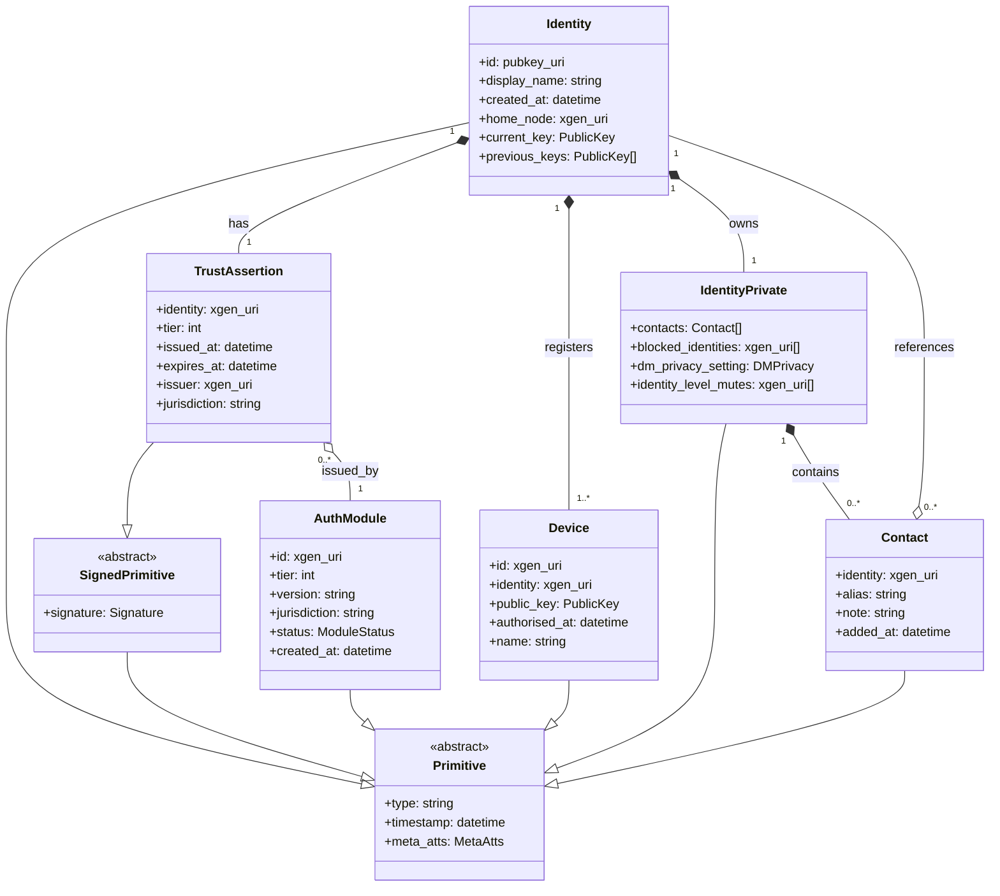
```mermaid
classDiagram

    %% ── Base classes ──────────────────────────────────────────────
    class Primitive {
        <<abstract>>
        +type: string
        +timestamp: datetime
        +meta_atts: MetaAtts
    }
    class SignedPrimitive {
        <<abstract>>
        +signature: Signature
    }
    SignedPrimitive --|> Primitive

    %% ── Identity layer ────────────────────────────────────────────
    class Identity {
        +id: pubkey_uri
        +display_name: string
        +created_at: datetime
        +home_node: xgen_uri
        +current_key: PublicKey
        +previous_keys: PublicKey[]
    }
    class TrustAssertion {
        +identity: xgen_uri
        +tier: int
        +issued_at: datetime
        +expires_at: datetime
        +issuer: xgen_uri
        +jurisdiction: string
    }
    class Device {
        +id: xgen_uri
        +identity: xgen_uri
        +public_key: PublicKey
        +authorised_at: datetime
        +name: string
    }
    class AuthModule {
        +id: xgen_uri
        +tier: int
        +version: string
        +jurisdiction: string
        +status: ModuleStatus
        +created_at: datetime
    }

    %% ── Social layer ──────────────────────────────────────────────
    class Contact {
        +identity: xgen_uri
        +alias: string
        +note: string
        +added_at: datetime
    }
    class IdentityPrivate {
        +contacts: Contact[]
        +blocked_identities: xgen_uri[]
        +dm_privacy_setting: DMPrivacy
        +identity_level_mutes: xgen_uri[]
    }

    Identity --|> Primitive
    TrustAssertion --|> SignedPrimitive
    Device --|> Primitive
    AuthModule --|> Primitive
    Contact --|> Primitive
    IdentityPrivate --|> Primitive

    %% ── Relationships ─────────────────────────────────────────────
    Identity "1" *-- "1" TrustAssertion : has
    Identity "1" *-- "1..*" Device : registers
    Identity "1" *-- "1" IdentityPrivate : owns
    TrustAssertion "0..*" o-- "1" AuthModule : issued_by
    IdentityPrivate "1" *-- "0..*" Contact : contains
    Contact "0..*" o-- "1" Identity : references
    %% Note: Device.authorised_by references another Device (self-reference).
    %% Omitted — Mermaid renders self-references as empty ghost boxes.
```

---

## C.2 — Event Primitive

The atom of the protocol. Every action in XGen is an Event.

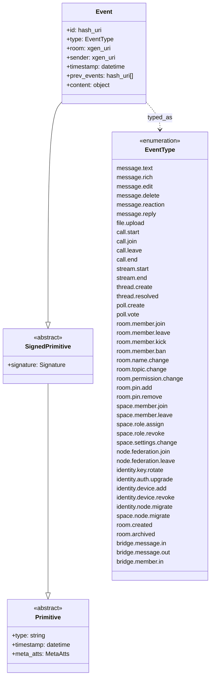
```mermaid
classDiagram
    class Primitive {
        <<abstract>>
        +type: string
        +timestamp: datetime
        +meta_atts: MetaAtts
    }
    class SignedPrimitive {
        <<abstract>>
        +signature: Signature
    }
    class Event {
        +id: hash_uri
        +type: EventType
        +room: xgen_uri
        +sender: xgen_uri
        +timestamp: datetime
        +prev_events: hash_uri[]
        +content: object
    }
    class EventType {
        <<enumeration>>
        message.text
        message.rich
        message.edit
        message.delete
        message.reaction
        message.reply
        file.upload
        call.start
        call.join
        call.leave
        call.end
        stream.start
        stream.end
        thread.create
        thread.resolved
        poll.create
        poll.vote
        room.member.join
        room.member.leave
        room.member.kick
        room.member.ban
        room.name.change
        room.topic.change
        room.permission.change
        room.pin.add
        room.pin.remove
        space.member.join
        space.member.leave
        space.role.assign
        space.role.revoke
        space.settings.change
        node.federation.join
        node.federation.leave
        identity.key.rotate
        identity.auth.upgrade
        identity.device.add
        identity.device.revoke
        identity.node.migrate
        space.node.migrate
        room.created
        room.archived
        bridge.message.in
        bridge.message.out
        bridge.member.in
    }

    SignedPrimitive --|> Primitive
    Event --|> SignedPrimitive
    Event ..> EventType : typed_as
    %% Note: Event.prev_events references other Events (self-reference).
    %% Self-referencing arrows omitted — Mermaid renders them as empty ghost boxes.
```

---

## C.3 — Thread Primitive

A scoped, bounded conversation within a Room. Not a Room. Not a reply chain.

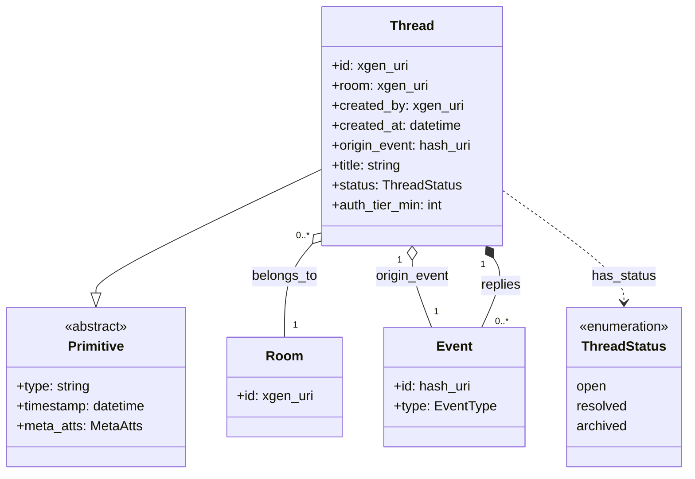
```mermaid
classDiagram
    class Primitive {
        <<abstract>>
        +type: string
        +timestamp: datetime
        +meta_atts: MetaAtts
    }
    class Thread {
        +id: xgen_uri
        +room: xgen_uri
        +created_by: xgen_uri
        +created_at: datetime
        +origin_event: hash_uri
        +title: string
        +status: ThreadStatus
        +auth_tier_min: int
    }
    class ThreadStatus {
        <<enumeration>>
        open
        resolved
        archived
    }
    class Event {
        +id: hash_uri
        +type: EventType
    }
    class Room {
        +id: xgen_uri
    }

    Thread --|> Primitive
    Thread "0..*" o-- "1" Room : belongs_to
    Thread "1" o-- "1" Event : origin_event
    Thread "1" *-- "0..*" Event : replies
    Thread ..> ThreadStatus : has_status
```

---

## C.4 — Room Primitive

The core communication unit. A persistent, federated container of Events and Threads.

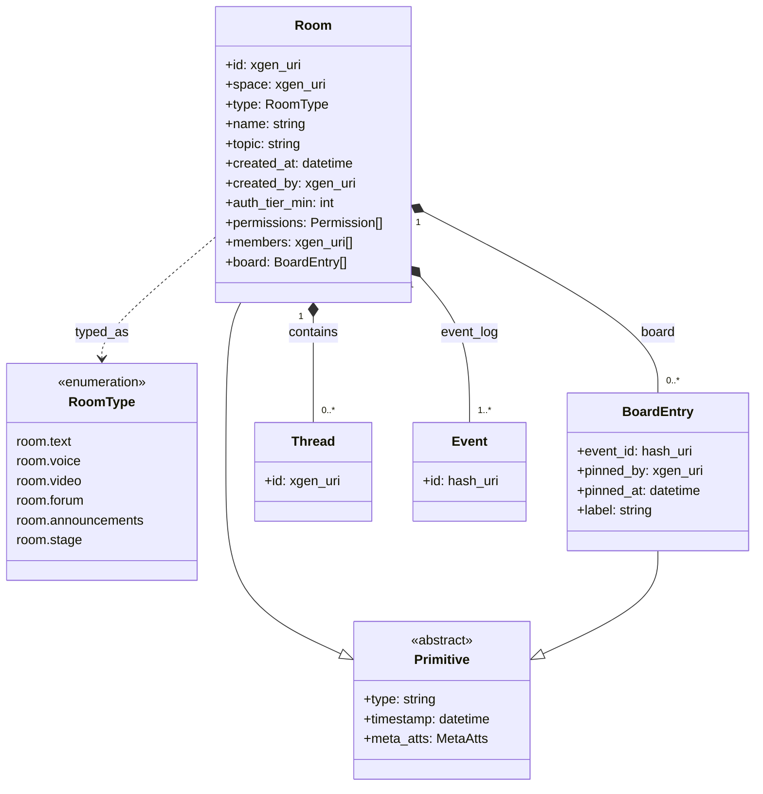
```mermaid
classDiagram
    class Primitive {
        <<abstract>>
        +type: string
        +timestamp: datetime
        +meta_atts: MetaAtts
    }
    class Room {
        +id: xgen_uri
        +space: xgen_uri
        +type: RoomType
        +name: string
        +topic: string
        +created_at: datetime
        +created_by: xgen_uri
        +auth_tier_min: int
        +permissions: Permission[]
        +members: xgen_uri[]
        +board: BoardEntry[]
    }
    class RoomType {
        <<enumeration>>
        room.text
        room.voice
        room.video
        room.forum
        room.announcements
        room.stage
    }
    class BoardEntry {
        +event_id: hash_uri
        +pinned_by: xgen_uri
        +pinned_at: datetime
        +label: string
    }
    class Thread {
        +id: xgen_uri
    }
    class Event {
        +id: hash_uri
    }

    Room --|> Primitive
    BoardEntry --|> Primitive
    Room ..> RoomType : typed_as
    Room "1" *-- "1..*" Event : event_log
    Room "1" *-- "0..*" Thread : contains
    Room "1" *-- "0..*" BoardEntry : board
```

---

## C.5 — Space Primitive

The top-level container. A governed, portable, cryptographically-identified community.

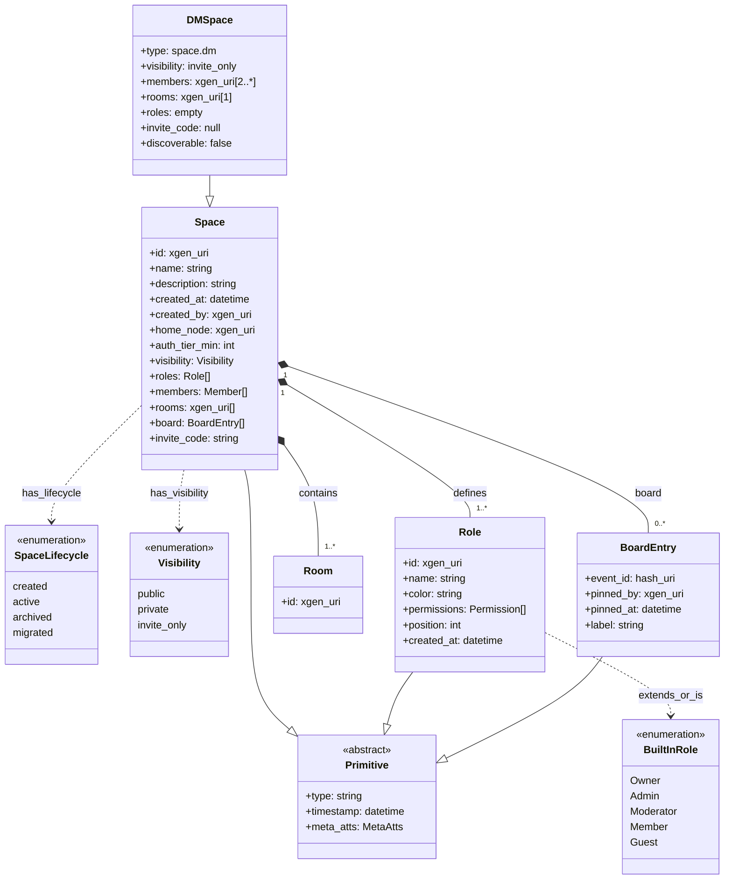
```mermaid
classDiagram
    class Primitive {
        <<abstract>>
        +type: string
        +timestamp: datetime
        +meta_atts: MetaAtts
    }
    class Space {
        +id: xgen_uri
        +name: string
        +description: string
        +created_at: datetime
        +created_by: xgen_uri
        +home_node: xgen_uri
        +auth_tier_min: int
        +visibility: Visibility
        +roles: Role[]
        +members: Member[]
        +rooms: xgen_uri[]
        +board: BoardEntry[]
        +invite_code: string
    }
    class DMSpace {
        +type: space.dm
        +visibility: invite_only
        +members: xgen_uri[2..*]
        +rooms: xgen_uri[1]
        +roles: empty
        +invite_code: null
        +discoverable: false
    }
    class SpaceLifecycle {
        <<enumeration>>
        created
        active
        archived
        migrated
    }
    class Visibility {
        <<enumeration>>
        public
        private
        invite_only
    }
    class Role {
        +id: xgen_uri
        +name: string
        +color: string
        +permissions: Permission[]
        +position: int
        +created_at: datetime
    }
    class BuiltInRole {
        <<enumeration>>
        Owner
        Admin
        Moderator
        Member
        Guest
    }
    class Room {
        +id: xgen_uri
    }
    class BoardEntry {
        +event_id: hash_uri
        +pinned_by: xgen_uri
        +pinned_at: datetime
        +label: string
    }

    Space --|> Primitive
    DMSpace --|> Space
    Role --|> Primitive
    BoardEntry --|> Primitive
    Space ..> Visibility : has_visibility
    Space ..> SpaceLifecycle : has_lifecycle
    Space "1" *-- "1..*" Room : contains
    Space "1" *-- "1..*" Role : defines
    Space "1" *-- "0..*" BoardEntry : board
    Role ..> BuiltInRole : extends_or_is
```

---

## C.6 — Node Primitive

The infrastructure unit. The concrete boundary between hardware and protocol.

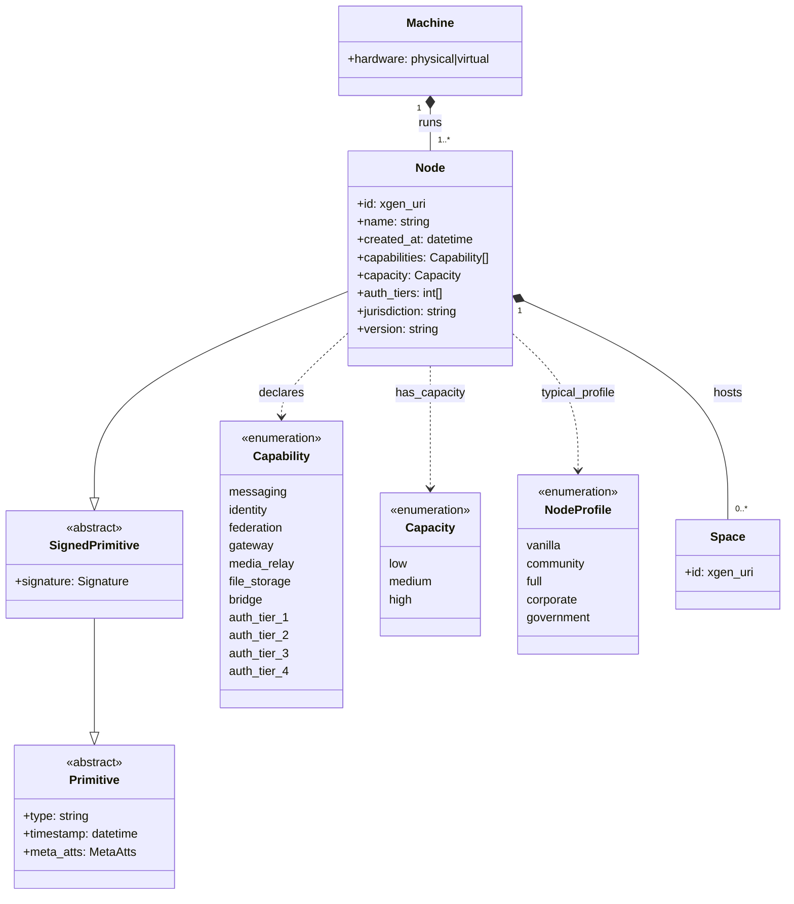
```mermaid
classDiagram
    class Primitive {
        <<abstract>>
        +type: string
        +timestamp: datetime
        +meta_atts: MetaAtts
    }
    class SignedPrimitive {
        <<abstract>>
        +signature: Signature
    }
    class Node {
        +id: xgen_uri
        +name: string
        +created_at: datetime
        +capabilities: Capability[]
        +capacity: Capacity
        +auth_tiers: int[]
        +jurisdiction: string
        +version: string
    }
    class Capability {
        <<enumeration>>
        messaging
        identity
        federation
        gateway
        media_relay
        file_storage
        bridge
        auth_tier_1
        auth_tier_2
        auth_tier_3
        auth_tier_4
    }
    class Capacity {
        <<enumeration>>
        low
        medium
        high
    }
    class NodeProfile {
        <<enumeration>>
        vanilla
        community
        full
        corporate
        government
    }
    class Machine {
        +hardware: physical|virtual
    }
    class Space {
        +id: xgen_uri
    }

    SignedPrimitive --|> Primitive
    Node --|> SignedPrimitive
    Machine "1" *-- "1..*" Node : runs
    Node "1" *-- "0..*" Space : hosts
    Node ..> Capability : declares
    Node ..> Capacity : has_capacity
    Node ..> NodeProfile : typical_profile
    %% Note: Node federates_with other Nodes (self-reference).
    %% Omitted — Mermaid renders self-references as empty ghost boxes.
```

---

## C.7 — Identity Primitive

The server-independent keypair. The user's permanent protocol presence.

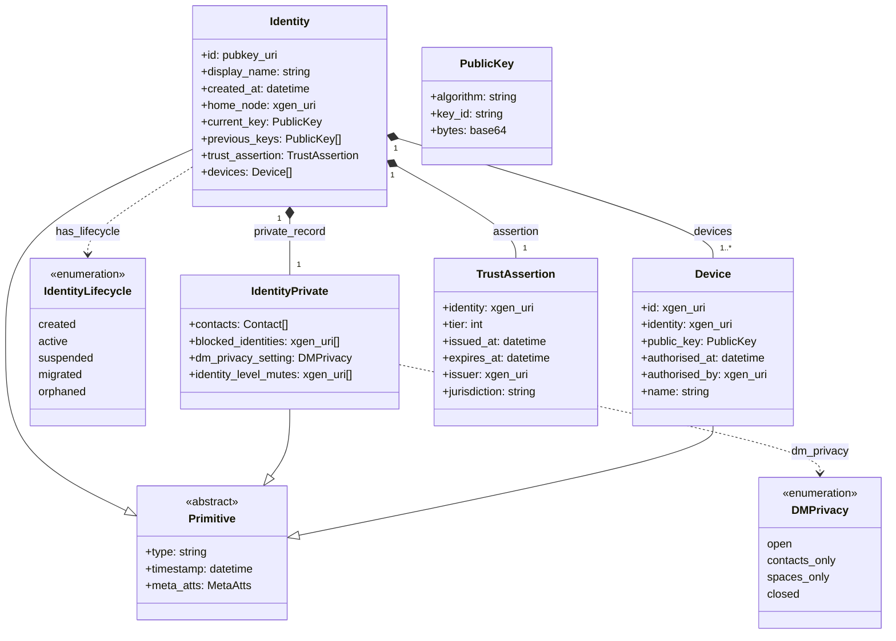
```mermaid
classDiagram
    class Primitive {
        <<abstract>>
        +type: string
        +timestamp: datetime
        +meta_atts: MetaAtts
    }
    class Identity {
        +id: pubkey_uri
        +display_name: string
        +created_at: datetime
        +home_node: xgen_uri
        +current_key: PublicKey
        +previous_keys: PublicKey[]
        +trust_assertion: TrustAssertion
        +devices: Device[]
    }
    class IdentityPrivate {
        +contacts: Contact[]
        +blocked_identities: xgen_uri[]
        +dm_privacy_setting: DMPrivacy
        +identity_level_mutes: xgen_uri[]
    }
    class IdentityLifecycle {
        <<enumeration>>
        created
        active
        suspended
        migrated
        orphaned
    }
    class DMPrivacy {
        <<enumeration>>
        open
        contacts_only
        spaces_only
        closed
    }
    class Device {
        +id: xgen_uri
        +identity: xgen_uri
        +public_key: PublicKey
        +authorised_at: datetime
        +authorised_by: xgen_uri
        +name: string
    }
    class TrustAssertion {
        +identity: xgen_uri
        +tier: int
        +issued_at: datetime
        +expires_at: datetime
        +issuer: xgen_uri
        +jurisdiction: string
    }
    class PublicKey {
        +algorithm: string
        +key_id: string
        +bytes: base64
    }

    Identity --|> Primitive
    IdentityPrivate --|> Primitive
    Device --|> Primitive
    Identity "1" *-- "1" IdentityPrivate : private_record
    Identity "1" *-- "1" TrustAssertion : assertion
    Identity "1" *-- "1..*" Device : devices
    Identity ..> IdentityLifecycle : has_lifecycle
    IdentityPrivate ..> DMPrivacy : dm_privacy
    %% Note: Device.authorised_by references another Device (self-reference).
    %% Omitted — Mermaid renders self-references as empty ghost boxes.
```

---

## C.8 — Auth Module & Trust Assertion

The pluggable authentication slot and its standardised output.

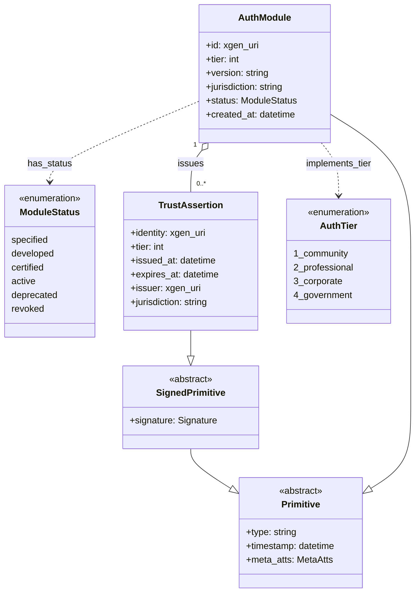
```mermaid
classDiagram
    class Primitive {
        <<abstract>>
        +type: string
        +timestamp: datetime
        +meta_atts: MetaAtts
    }
    class SignedPrimitive {
        <<abstract>>
        +signature: Signature
    }
    class AuthModule {
        +id: xgen_uri
        +tier: int
        +version: string
        +jurisdiction: string
        +status: ModuleStatus
        +created_at: datetime
    }
    class ModuleStatus {
        <<enumeration>>
        specified
        developed
        certified
        active
        deprecated
        revoked
    }
    class TrustAssertion {
        +identity: xgen_uri
        +tier: int
        +issued_at: datetime
        +expires_at: datetime
        +issuer: xgen_uri
        +jurisdiction: string
    }
    class AuthTier {
        <<enumeration>>
        1_community
        2_professional
        3_corporate
        4_government
    }

    SignedPrimitive --|> Primitive
    AuthModule --|> Primitive
    TrustAssertion --|> SignedPrimitive
    AuthModule ..> ModuleStatus : has_status
    AuthModule ..> AuthTier : implements_tier
    AuthModule "1" o-- "0..*" TrustAssertion : issues
```

---

## C.9 — Contact Model & User Representation

The private social layer. Stored encrypted in the Identity private record.

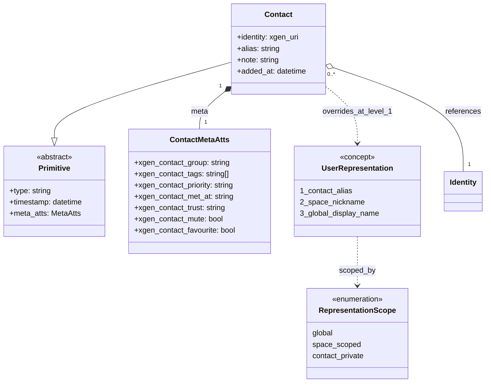
```mermaid
classDiagram
    class Primitive {
        <<abstract>>
        +type: string
        +timestamp: datetime
        +meta_atts: MetaAtts
    }
    class Contact {
        +identity: xgen_uri
        +alias: string
        +note: string
        +added_at: datetime
    }
    class ContactMetaAtts {
        +xgen_contact_group: string
        +xgen_contact_tags: string[]
        +xgen_contact_priority: string
        +xgen_contact_met_at: string
        +xgen_contact_trust: string
        +xgen_contact_mute: bool
        +xgen_contact_favourite: bool
    }
    class UserRepresentation {
        <<concept>>
        1_contact_alias
        2_space_nickname
        3_global_display_name
    }
    class RepresentationScope {
        <<enumeration>>
        global
        space_scoped
        contact_private
    }

    Contact --|> Primitive
    Contact "1" *-- "1" ContactMetaAtts : meta
    Contact "0..*" o-- "1" Identity : references
    UserRepresentation ..> RepresentationScope : scoped_by
    Contact ..> UserRepresentation : overrides_at_level_1
```

---

## C.10 — Direct Message Space

A specialisation of Space. Minimal, private, no governance overhead.

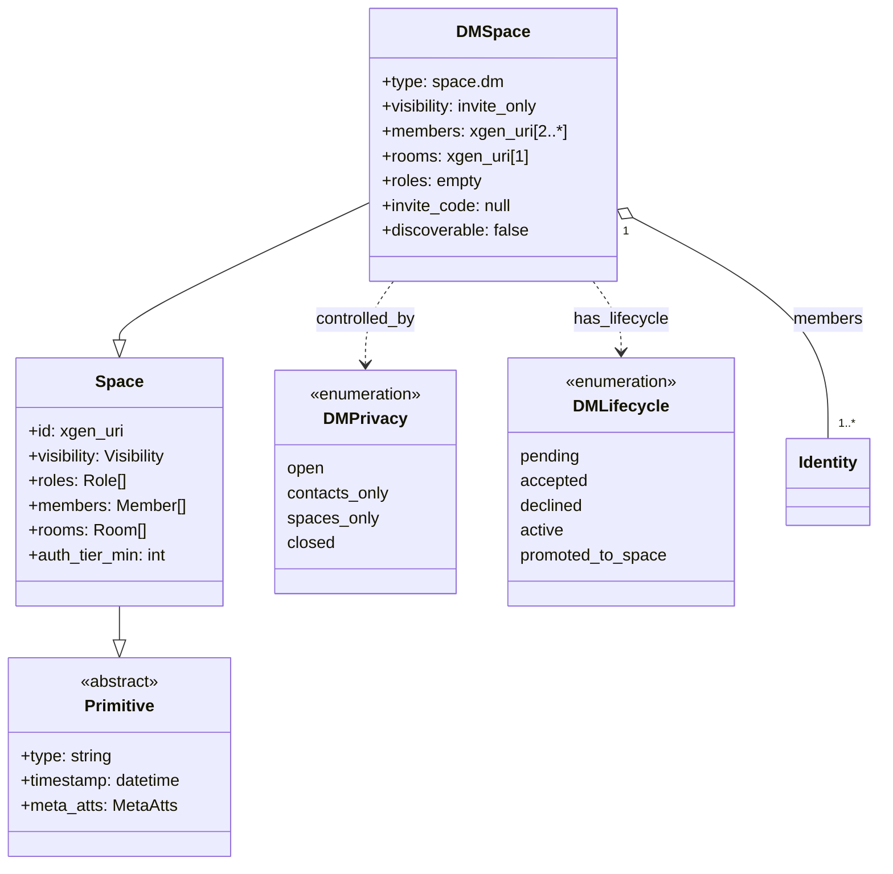
```mermaid
classDiagram
    class Primitive {
        <<abstract>>
        +type: string
        +timestamp: datetime
        +meta_atts: MetaAtts
    }
    class Space {
        +id: xgen_uri
        +visibility: Visibility
        +roles: Role[]
        +members: Member[]
        +rooms: Room[]
        +auth_tier_min: int
    }
    class DMSpace {
        +type: space.dm
        +visibility: invite_only
        +members: xgen_uri[2..*]
        +rooms: xgen_uri[1]
        +roles: empty
        +invite_code: null
        +discoverable: false
    }
    class DMPrivacy {
        <<enumeration>>
        open
        contacts_only
        spaces_only
        closed
    }
    class DMLifecycle {
        <<enumeration>>
        pending
        accepted
        declined
        active
        promoted_to_space
    }

    Space --|> Primitive
    DMSpace --|> Space
    DMSpace ..> DMPrivacy : controlled_by
    DMSpace ..> DMLifecycle : has_lifecycle
    DMSpace "1" o-- "1..*" Identity : members
```

---

## C.11 — Cryptographic Primitives

The algorithm-agile signature and hash types used across all signed primitives.

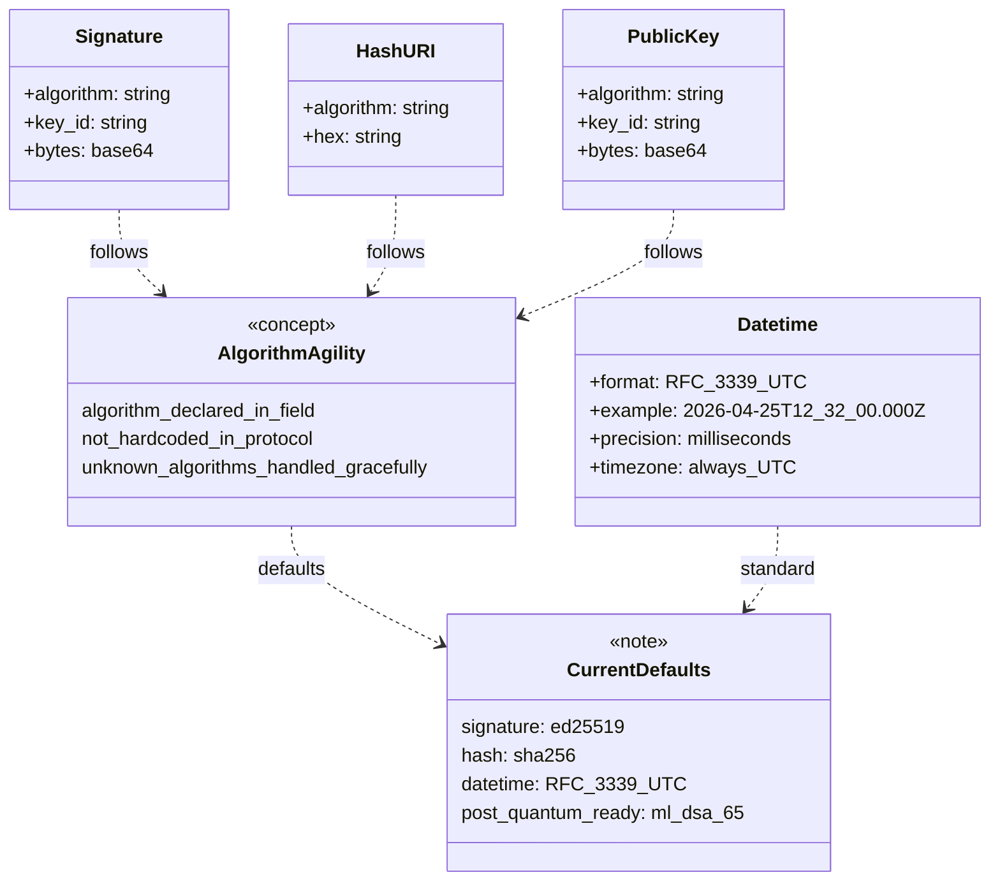
```mermaid
classDiagram
    class Signature {
        +algorithm: string
        +key_id: string
        +bytes: base64
    }
    class HashURI {
        +algorithm: string
        +hex: string
    }
    class PublicKey {
        +algorithm: string
        +key_id: string
        +bytes: base64
    }
    class Datetime {
        +format: RFC_3339_UTC
        +example: 2026-04-25T12_32_00.000Z
        +precision: milliseconds
        +timezone: always_UTC
    }
    class AlgorithmAgility {
        <<concept>>
        algorithm_declared_in_field
        not_hardcoded_in_protocol
        unknown_algorithms_handled_gracefully
    }
    class CurrentDefaults {
        <<note>>
        signature: ed25519
        hash: sha256
        datetime: RFC_3339_UTC
        post_quantum_ready: ml_dsa_65
    }

    Signature ..> AlgorithmAgility : follows
    HashURI ..> AlgorithmAgility : follows
    PublicKey ..> AlgorithmAgility : follows
    AlgorithmAgility ..> CurrentDefaults : defaults
    Datetime ..> CurrentDefaults : standard
```

---

## C.12 — meta-atts Universal Extension

The namespaced key-value map carried by every primitive. Inherited from `Primitive`.

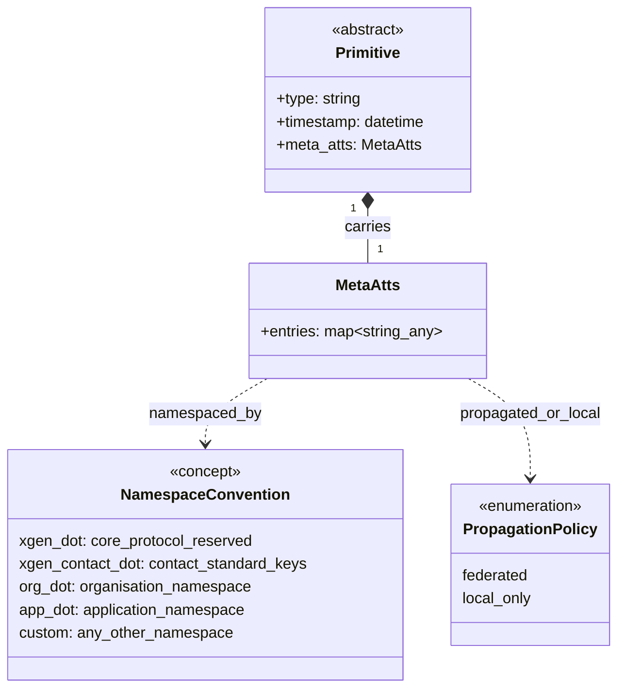
```mermaid
classDiagram
    class MetaAtts {
        +entries: map~string_any~
    }
    class NamespaceConvention {
        <<concept>>
        xgen_dot: core_protocol_reserved
        xgen_contact_dot: contact_standard_keys
        org_dot: organisation_namespace
        app_dot: application_namespace
        custom: any_other_namespace
    }
    class PropagationPolicy {
        <<enumeration>>
        federated
        local_only
    }
    class Primitive {
        <<abstract>>
        +type: string
        +timestamp: datetime
        +meta_atts: MetaAtts
    }

    Primitive "1" *-- "1" MetaAtts : carries
    MetaAtts ..> NamespaceConvention : namespaced_by
    MetaAtts ..> PropagationPolicy : propagated_or_local
```

---

## C.13 — Federation Relationships

How Nodes, Spaces, Rooms, and Identities relate in a federated network.

**Membership-driven Identity replication:** every Node hosting a Space the user belongs to holds a replica of that user's public Identity record. The more Spaces a user joins across different Nodes, the more widely their Identity is replicated — naturally, without any additional mechanism. In the same way that a person who knows many people across many communities has a stronger social presence and is harder to erase from collective memory, a user active across many Spaces has an Identity so widely distributed that no single failure can erase them.

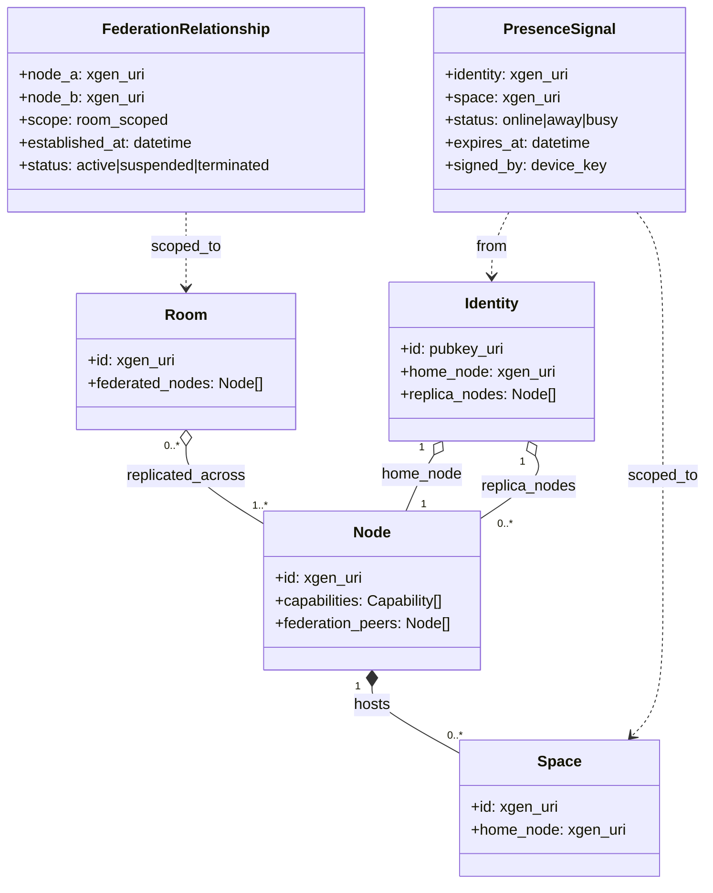
```mermaid
classDiagram
    class Node {
        +id: xgen_uri
        +capabilities: Capability[]
        +federation_peers: Node[]
    }
    class Space {
        +id: xgen_uri
        +home_node: xgen_uri
    }
    class Room {
        +id: xgen_uri
        +federated_nodes: Node[]
    }
    class Identity {
        +id: pubkey_uri
        +home_node: xgen_uri
        +replica_nodes: Node[]
    }
    class FederationRelationship {
        +node_a: xgen_uri
        +node_b: xgen_uri
        +scope: room_scoped
        +established_at: datetime
        +status: active|suspended|terminated
    }
    class PresenceSignal {
        +identity: xgen_uri
        +space: xgen_uri
        +status: online|away|busy
        +expires_at: datetime
        +signed_by: device_key
    }

    %% Note: Node federates_with other Nodes (self-reference).
    %% Omitted — Mermaid renders self-references as empty ghost boxes.
    Node "1" *-- "0..*" Space : hosts
    Room "0..*" o-- "1..*" Node : replicated_across
    Identity "1" o-- "1" Node : home_node
    Identity "1" o-- "0..*" Node : replica_nodes
    FederationRelationship ..> Room : scoped_to
    PresenceSignal ..> Space : scoped_to
    PresenceSignal ..> Identity : from
```

---

## C.14 — Reference Client Layers

The four-layer architecture of the reference client.

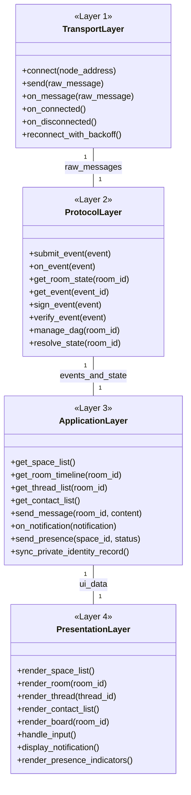
```mermaid
classDiagram
    class TransportLayer {
        <<Layer 1>>
        +connect(node_address)
        +send(raw_message)
        +on_message(raw_message)
        +on_connected()
        +on_disconnected()
        +reconnect_with_backoff()
    }
    class ProtocolLayer {
        <<Layer 2>>
        +submit_event(event)
        +on_event(event)
        +get_room_state(room_id)
        +get_event(event_id)
        +sign_event(event)
        +verify_event(event)
        +manage_dag(room_id)
        +resolve_state(room_id)
    }
    class ApplicationLayer {
        <<Layer 3>>
        +get_space_list()
        +get_room_timeline(room_id)
        +get_thread_list(room_id)
        +get_contact_list()
        +send_message(room_id, content)
        +on_notification(notification)
        +send_presence(space_id, status)
        +sync_private_identity_record()
    }
    class PresentationLayer {
        <<Layer 4>>
        +render_space_list()
        +render_room(room_id)
        +render_thread(thread_id)
        +render_contact_list()
        +render_board(room_id)
        +handle_input()
        +display_notification()
        +render_presence_indicators()
    }

    TransportLayer "1" -- "1" ProtocolLayer : raw_messages
    ProtocolLayer "1" -- "1" ApplicationLayer : events_and_state
    ApplicationLayer "1" -- "1" PresentationLayer : ui_data
```

---

## Session Log

### Session 1 — April 2026 (JozefN)
**Covered:** Appendix C created. Fourteen diagrams written in Mermaid class diagram syntax: C.1 full overview, C.2 Event, C.3 Thread, C.4 Room, C.5 Space (with DMSpace specialisation), C.6 Node, C.7 Identity (with IdentityPrivate), C.8 Auth Module & Trust Assertion, C.9 Contact Model, C.10 Direct Message Space, C.11 Cryptographic Primitives, C.12 meta-atts, C.13 Federation Relationships, C.14 Reference Client Layers.

### Session 2 — April 2026 (JozefN)
**Covered:** Base class hierarchy added. C.0 section written — Primitive (abstract) and SignedPrimitive (abstract) defined as universal base classes. Primitive carries type, timestamp, meta_atts. SignedPrimitive extends Primitive with signature. Event, Node, TrustAssertion inherit from SignedPrimitive. All other primitives inherit directly from Primitive. DMSpace inherits from Space. Type value table documented per primitive. All diagrams updated to show inheritance from base classes. All datetime fields updated from Unix milliseconds to RFC 3339 UTC (datetime type). Node created_at field added. Datetime standard noted in file header.

### Session 3 — April 2026 (JozefN)
**Covered:** C.1 split into C.1a (Infrastructure & Protocol Primitives) and C.1b (Identity, Social & Supporting Primitives) to fix Mermaid rendering overflow. All self-referencing arrows removed from C.2 (Event.prev_events), C.7 (Device.authorised_by), C.1a, C.1b, C.6, and C.13 (Node.federates_with) — replaced with Mermaid comments explaining the omission. Self-references render as empty ghost boxes in Mermaid and are documented in prose instead. Self-referencing note added to file Purpose section.
