# XGen Protocol — Appendix C: Primitive Schemas & Inheritance Diagrams
> Status: wip
> Version: 0.1
> Date: April 2026
> Last edited: April 2026
> Language: English
> Author: JozefN
> License: BSL 1.1 (converts to GPL upon project handover)
> Note: Slovak translation planned — will be saved as xgen_appendix_c_sk.md

---

## Purpose

This appendix provides a complete reference of all XGen Protocol primitive schemas and their inheritance relationships in a single document. It is intended as a theoretical implementation guide — a developer starting work on a Node, client, or Auth Module should read this appendix alongside Chapter 3 (Specification) to understand both the data structures and how they relate to each other.

All diagrams use [Mermaid](https://mermaid.js.org/) class diagram syntax, which renders natively in GitHub, VS Code with the Mermaid extension, and most modern markdown viewers.

---

## C.1 — Inheritance & Relationship Overview

The top-level view of all primitives and their relationships. Read the arrows as:
- `<|--` inheritance (is-a)
- `*--` composition (owns, lifecycle depends on parent)
- `o--` aggregation (references, independent lifecycle)
- `--` association (relates to)
- Numbers on arrows indicate cardinality.

```mermaid
classDiagram

    %% ── Infrastructure layer ──────────────────────────────────────
    class Machine {
        +hardware: physical|virtual
    }
    class Node {
        +id: xgen_uri
        +name: string
        +capabilities: Capability[]
        +capacity: low|medium|high
        +auth_tiers: int[]
        +jurisdiction: string
        +version: string
        +signature: Signature
        +meta_atts: MetaAtts
    }

    %% ── Protocol primitives ───────────────────────────────────────
    class Space {
        +id: xgen_uri
        +name: string
        +description: string
        +created_at: timestamp
        +created_by: Identity
        +home_node: Node
        +auth_tier_min: int
        +visibility: public|private|invite_only
        +roles: Role[]
        +members: Member[]
        +rooms: Room[]
        +board: BoardEntry[]
        +invite_code: string
        +meta_atts: MetaAtts
    }
    class DMSpace {
        +type: dm
        +visibility: invite_only
        +members: Identity[2..*]
        +rooms: Room[1]
        +roles: empty
        +invite_code: null
        +discoverable: false
    }
    class Room {
        +id: xgen_uri
        +space: Space
        +type: RoomType
        +name: string
        +topic: string
        +created_at: timestamp
        +created_by: Identity
        +auth_tier_min: int
        +permissions: Permission[]
        +members: Member[]
        +board: BoardEntry[]
        +meta_atts: MetaAtts
    }
    class Thread {
        +id: xgen_uri
        +room: Room
        +created_by: Identity
        +created_at: timestamp
        +origin_event: Event
        +title: string
        +status: open|resolved|archived
        +auth_tier_min: int
        +meta_atts: MetaAtts
    }
    class Event {
        +id: hash_uri
        +type: EventType
        +room: Room
        +sender: Identity
        +timestamp: timestamp
        +prev_events: Event[]
        +content: object
        +signature: Signature
        +meta_atts: MetaAtts
    }

    %% ── Identity layer ────────────────────────────────────────────
    class Identity {
        +id: pubkey_uri
        +display_name: string
        +created_at: timestamp
        +home_node: Node
        +current_key: PublicKey
        +previous_keys: PublicKey[]
        +trust_assertion: TrustAssertion
        +devices: Device[]
        +meta_atts: MetaAtts
    }
    class TrustAssertion {
        +identity: Identity
        +tier: int
        +issued_at: timestamp
        +expires_at: timestamp
        +issuer: AuthModule
        +jurisdiction: string
        +signature: Signature
        +meta_atts: MetaAtts
    }
    class Device {
        +id: xgen_uri
        +identity: Identity
        +public_key: PublicKey
        +authorised_at: timestamp
        +authorised_by: Device
        +name: string
    }
    class AuthModule {
        +id: xgen_uri
        +tier: int
        +version: string
        +jurisdiction: string
        +status: ModuleStatus
        +signature: Signature
    }

    %% ── Social layer ──────────────────────────────────────────────
    class Contact {
        +identity: Identity
        +alias: string
        +note: string
        +added_at: timestamp
        +meta_atts: MetaAtts
    }
    class IdentityPrivate {
        +contacts: Contact[]
        +blocked_identities: Identity[]
        +dm_privacy_setting: DMPrivacy
        +identity_level_mutes: Identity[]
        +meta_atts: MetaAtts
    }

    %% ── Supporting types ──────────────────────────────────────────
    class Role {
        +id: xgen_uri
        +name: string
        +color: string
        +permissions: Permission[]
        +position: int
        +meta_atts: MetaAtts
    }
    class BoardEntry {
        +event_id: hash_uri
        +pinned_by: Identity
        +pinned_at: timestamp
        +label: string
    }
    class Signature {
        +algorithm: string
        +key_id: string
        +bytes: base64
    }
    class MetaAtts {
        +entries: map~string_any~
    }

    %% ── Relationships ─────────────────────────────────────────────

    %% Infrastructure
    Machine "1" *-- "1..*" Node : hosts
    Node "1" *-- "0..*" Space : hosts

    %% Space hierarchy
    Space <|-- DMSpace : specialises
    Space "1" *-- "1..*" Room : contains
    Space "1" *-- "1..*" Role : defines
    Space "1" o-- "0..*" BoardEntry : board

    %% Room hierarchy
    Room "1" *-- "0..*" Thread : contains
    Room "1" *-- "1..*" Event : log
    Room "1" o-- "0..*" BoardEntry : board

    %% Thread
    Thread "1" o-- "1" Event : origin_event
    Thread "1" *-- "0..*" Event : replies

    %% Event
    Event "0..*" o-- "0..*" Event : prev_events
    Event "0..*" o-- "1" Identity : sender

    %% Identity
    Identity "1" *-- "1" TrustAssertion : has
    Identity "1" *-- "1..*" Device : registers
    Identity "1" *-- "1" IdentityPrivate : owns
    Identity "1" o-- "1" Node : home_node

    %% TrustAssertion
    TrustAssertion "0..*" o-- "1" AuthModule : issued_by

    %% Device
    Device "0..*" o-- "0..1" Device : authorised_by

    %% Social
    IdentityPrivate "1" *-- "0..*" Contact : contains
    Contact "0..*" o-- "1" Identity : references

    %% Supporting
    Space "1" o-- "0..*" Identity : members
    Room "1" o-- "0..*" Identity : members
    Event "1" *-- "1" Signature : has
    Event "1" *-- "1" MetaAtts : has
    Identity "1" *-- "1" MetaAtts : has
    Node "1" *-- "1" MetaAtts : has
```

---

## C.2 — Event Primitive

The atom of the protocol. Every action in XGen is an Event.

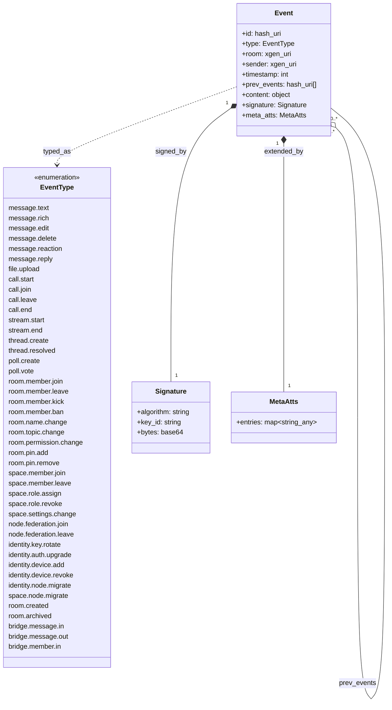

---

## C.3 — Thread Primitive

A scoped, bounded conversation within a Room. Not a Room. Not a reply chain.

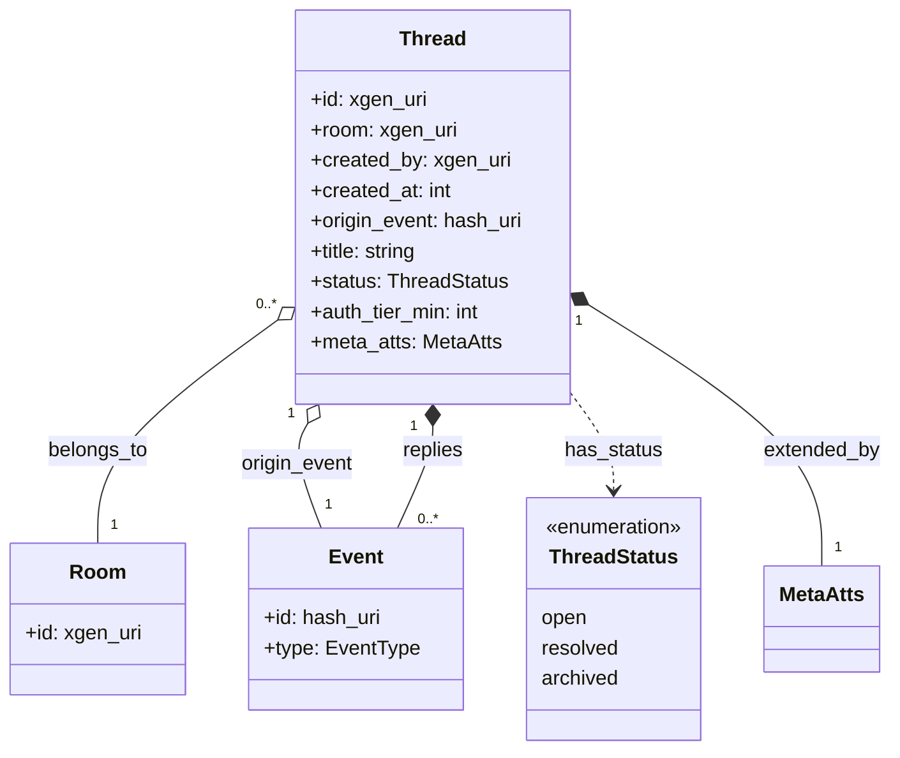

---

## C.4 — Room Primitive

The core communication unit. A persistent, federated container of Events and Threads.

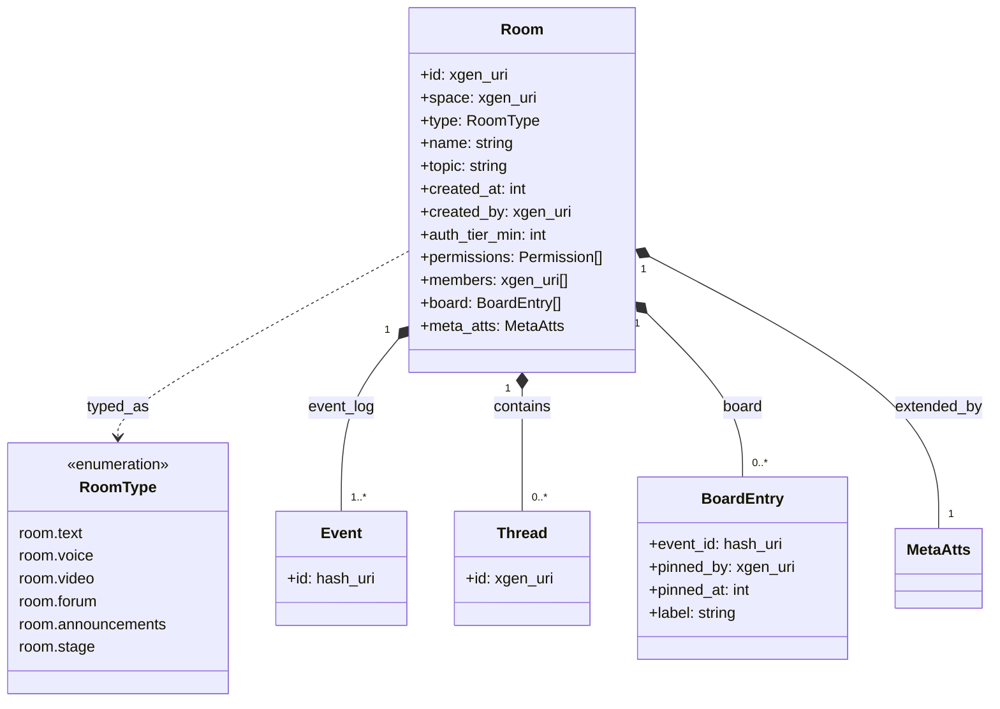

---

## C.5 — Space Primitive

The top-level container. A governed, portable, cryptographically-identified community.

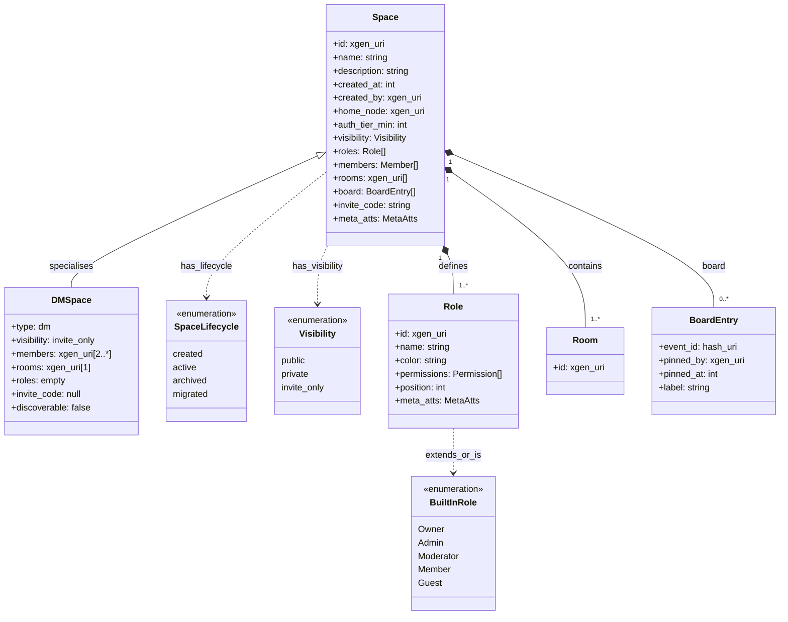

---

## C.6 — Node Primitive

The infrastructure unit. The concrete boundary between hardware and protocol.

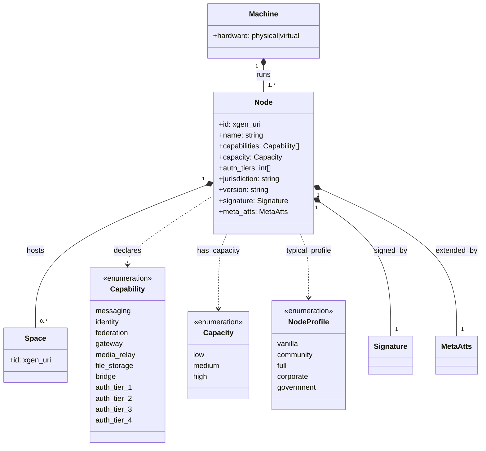

---

## C.7 — Identity Primitive

The server-independent keypair. The user's permanent protocol presence.

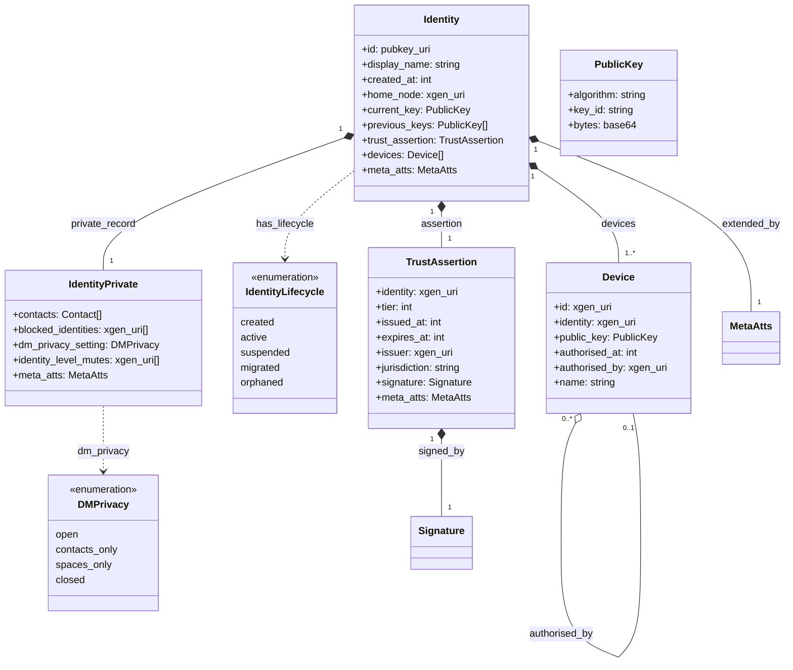

---

## C.8 — Auth Module & Trust Assertion

The pluggable authentication slot and its standardised output.

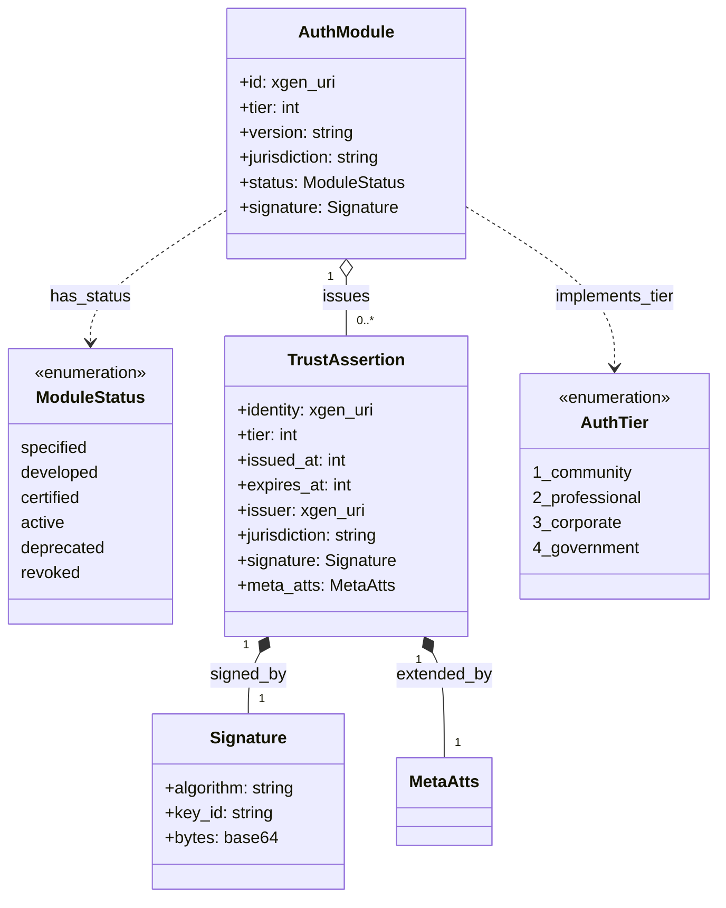

---

## C.9 — Contact Model & User Representation

The private social layer. Stored encrypted in the Identity private record.

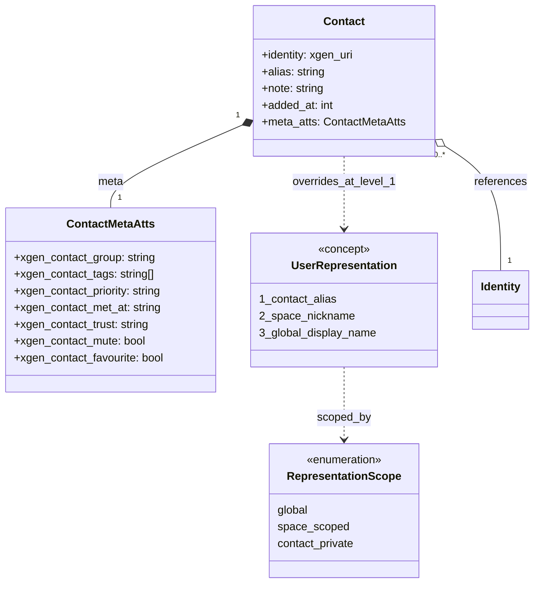

---

## C.10 — Direct Message Space

A specialisation of Space. Minimal, private, no governance overhead.

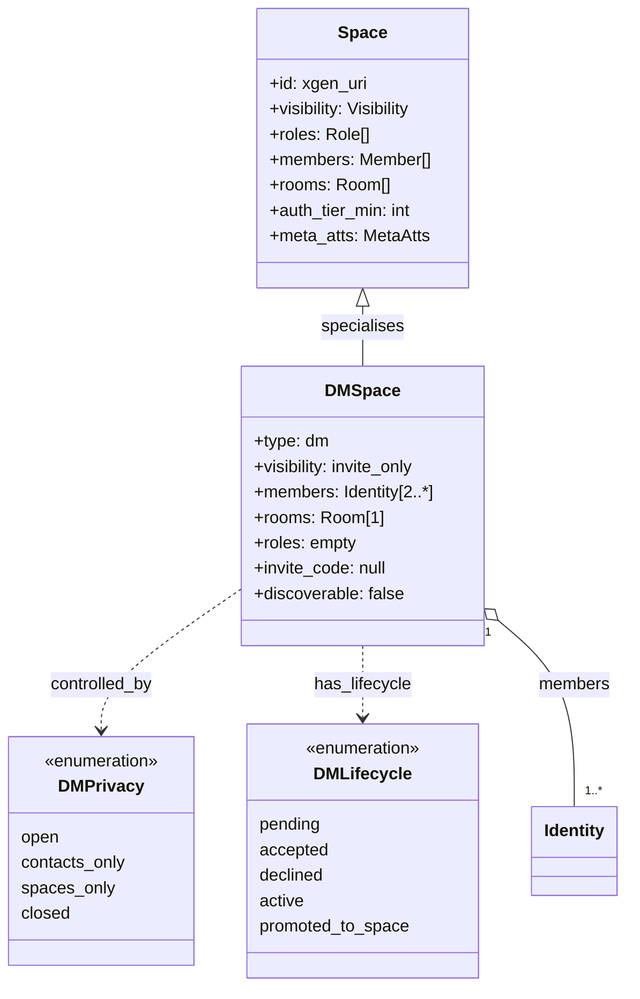

---

## C.11 — Cryptographic Primitives

The algorithm-agile signature and hash types used across all primitives.

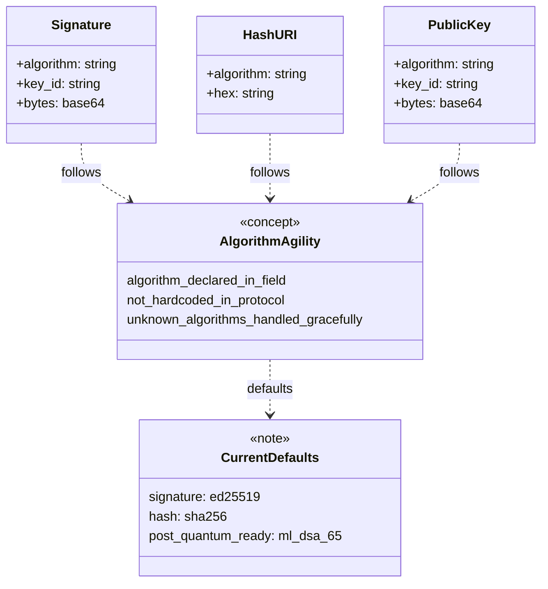

---

## C.12 — meta-atts Universal Extension

The namespaced key-value map carried by every primitive.

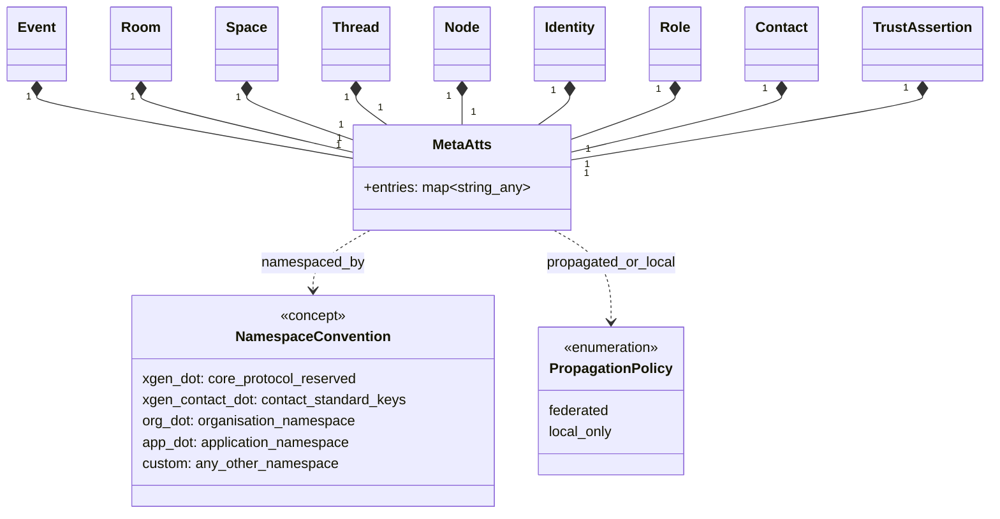

---

## C.13 — Federation Relationships

How Nodes, Spaces, Rooms, and Identities relate in a federated network.

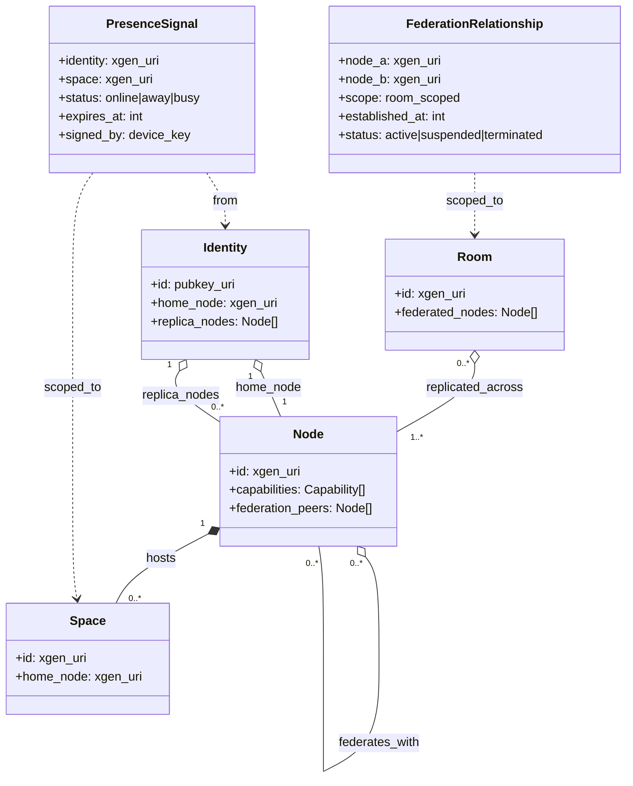

---

## C.14 — Reference Client Layers

The four-layer architecture of the reference client.

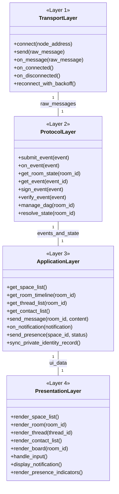

---

## Session Log

### Session 1 — April 2026 (JozefN)
**Covered:** Appendix C created. Fourteen diagrams written in Mermaid class diagram syntax: C.1 full overview with all primitives and relationships, C.2 Event, C.3 Thread, C.4 Room, C.5 Space (with DMSpace specialisation), C.6 Node, C.7 Identity (with IdentityPrivate), C.8 Auth Module & Trust Assertion, C.9 Contact Model & User Representation, C.10 Direct Message Space, C.11 Cryptographic Primitives, C.12 meta-atts universal extension, C.13 Federation Relationships, C.14 Reference Client Layers.
